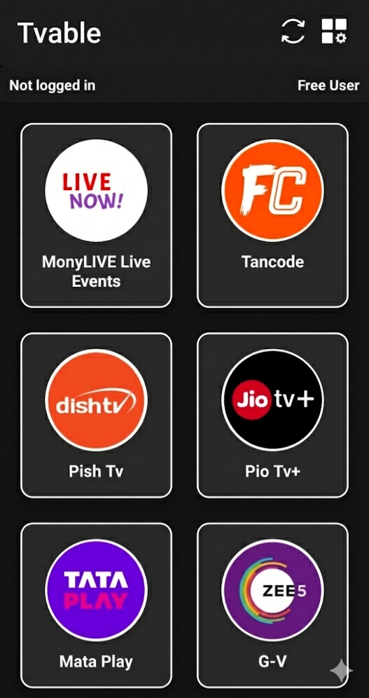
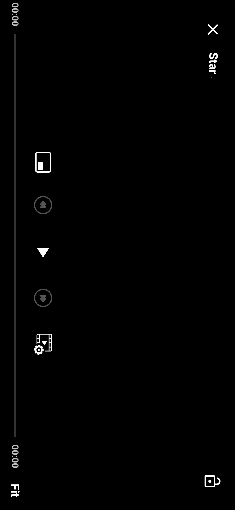
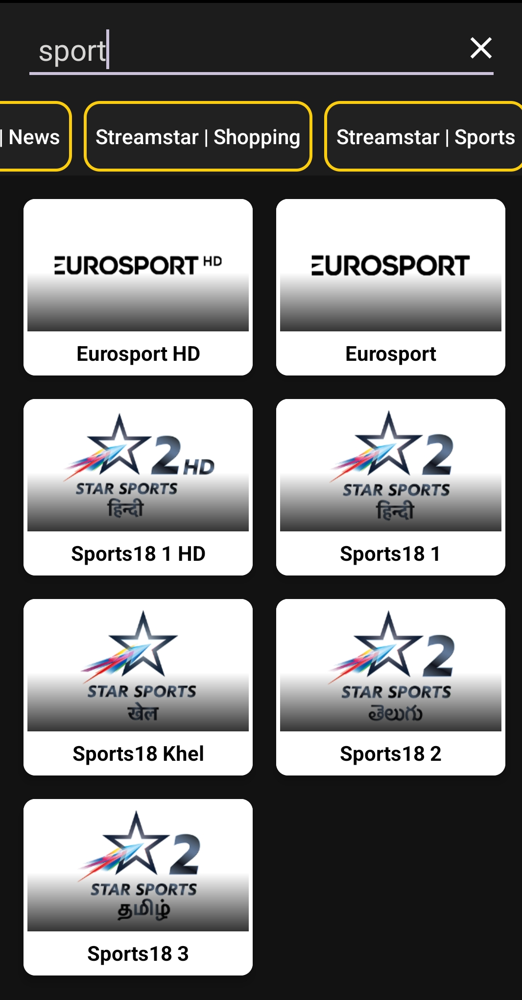

# 📺 TVable — Modern OTT-Style Streaming App

**TVable** is a fully functional, lightweight **OTT-style Android application** built to deliver a smooth, premium streaming experience — all within a compact **6 MB** package.  

It showcases professional-level app architecture, media streaming expertise, and polished UI/UX, making it ideal for **live TV**, **movies**, and **web series** platforms.

> 💡 *Note: This project is not open-source. The codebase is private, but an APK and visual previews are provided for evaluation.*

---

## ✨ Key Highlights

- 🎨 **Clean, Modern Interface:** Minimalistic design built for speed and visual appeal.  
- 📺 **Multi-format Playback:** Seamless support for major streaming protocols and direct URL streams.  
- 🎞️ **Advanced Player Controls:**  
  - Quality selection (Auto/Manual).  
  - Multi-audio track support.  
  - Custom ExoPlayer controllers for a professional-grade viewing experience.  
- ⚡ **Lightweight & Efficient:** Entire OTT experience under **6 MB** — optimized for performance.  
- 🔍 **Smart Search Engine:** Instantly find channels, movies, or web series within a unified interface.  
- ☁️ **Firebase Integration:**  
  - Remote URL & playlist management via Firebase Database.  
  - Real-time updates without app re-releases.  
- 🔔 **Push Notifications:** Updates for live events, new content, or platform announcements.  
- 🧩 **Modular Architecture:** Built to support Live TV, Movies, Web Series, or integrated OTT platforms (Free + Premium models).  

---

## 🧠 Tech Stack

| Component | Technology |
|------------|-------------|
| **Language** | Kotlin |
| **Media Player** | ExoPlayer (Customized UI + Advanced Controls) |
| **Backend Services** | Firebase Realtime Database, Firebase Cloud Messaging |
| **Design** | XML + Material UI |
| **Build Size** | ~6 MB |

---

## 💼 Purpose

TVable was developed as a **professional-level showcase project** to demonstrate practical skills in:
- Android app development with Kotlin  
- Media player customization  
- Scalable, remote-managed content systems  
- Designing production-ready OTT architectures  

It reflects capabilities relevant for **mobile app developer**, **streaming app engineer**, or **full-stack Android roles**.

---

## 📱 Screenshots

| Home Screen | Main View | Player View | Search Interface |
|--------------|--------------|--------------|------------------|
|  |  |  |  |

---

## 🔗 Demo & Testing

You can explore the app using the latest APK build below:

📥 [**Download TVable APK**](https://www.mediafire.com/file/k8jwrfeczq04bd3/StreamstarV4.apk/file)  

---

## ⚙️ Installation

1. Download the APK from the link above.  
2. Install it on any Android device running **Android 7.0+**.  
3. Launch the app and explore features such as category browsing, player controls, and search.  

---

## 🔒 Project Privacy

This project is a demonstration of skills and design — **the source code is private**.  
Interested recruiters, clients, or collaborators can **reach out directly** for:  
- Technical discussions  
- Feature walkthroughs  
- Custom development inquiries  

📩 **Contact:** [iamnikhiltomar@gmail.com]

---

## 🌟 Developer

Crafted with dedication by **Nikhil Tomar**,  
Android & Full-Stack Developer — passionate about modern streaming technology, UI/UX, and scalable app design.  

---
